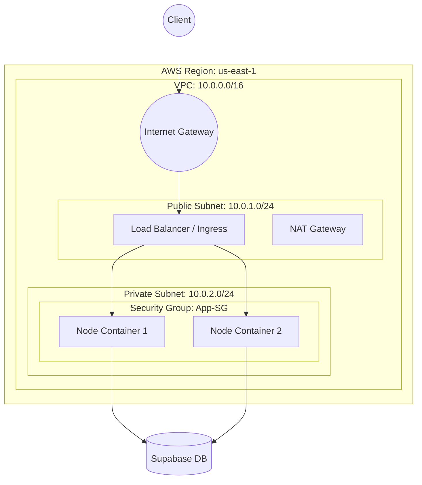

# Cloud Architecture & Logical Network Topology

## 1. High-Level Architecture Diagram

## 2. Logical Network Topology Description
*   **VPC**: A dedicated virtual network (`10.0.0.0/16`) isolates our resources.
*   **Public Subnet**: Hosts the Ingress Controller and Load Balancer. Accessible from the internet (`0.0.0.0/0`) via the Internet Gateway.
*   **Private Subnet**: Hosts the application containers. purely internal. No direct internet access.
*   **NAT Gateway**: Allows private instances to initiate outbound connections (e.g., to fetch updates or connect to Supabase) without accepting inbound traffic.
*   **Route Tables**:
    *   *Public RT*: Routes `0.0.0.0/0` to Internet Gateway.
    *   *Private RT*: Routes `0.0.0.0/0` to NAT Gateway.
